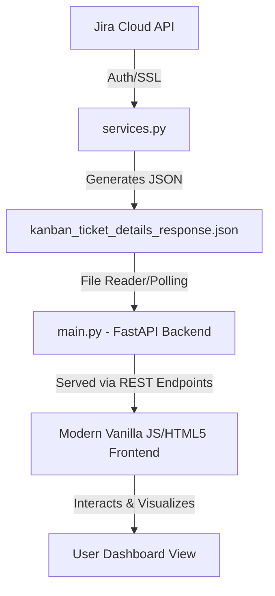

# Cloud Central Dashboard - Architectural Framework & Blueprint

This document outlines the architectural framework and structural prompt designed to build a high-fidelity, interactive analytical dashboard that surpasses the native visual capabilities of Jira or Confluence.

Using the rich data returned by `services.py`—including complex issue links, directional blockers, team classifications, story points, and advanced time metrics—we can create a dynamic, premium dashboard.

---

## 1. Value Proposition (Beyond standard Jira/Confluence)
Standard Jira boards display lists, and Confluence displays static tables. This dashboard provides **systemic intelligence**:
* **Dependency Network Graphing**: Interactive graph showing blocking chains, allowing teams to visualize critical paths and "multi-blocker" bottlenecks instantly.
* **Intra vs. Inter-Team Partitioning**: Color-coded boundary lines to highlight cross-team coordination bottlenecks vs. local task dependencies.
* **Analytical Time Analytics**: Active velocity metrics, due-date drift, ratio of estimated vs. spent time, and automated alert flags for stale/high-risk tickets.

---

## 2. System Architecture Blueprint



### Backend: `main.py` (FastAPI / Python)
`main.py` serves as a high-performance REST API. Its core responsibilities:
1. **Endpoint Serving**: Expose endpoints like `/api/tickets` (the full raw list), `/api/dependencies` (a computed graph structures), and `/api/metrics` (summarized time analytics).
2. **Graph Model Computation**: Construct a directed graph representation of the dependencies:
   * **Nodes**: Active tickets (key, summary, assignee, status, priority, story points).
   * **Edges**: Directed links labeled with relation types (`relates to`, `blocks`, `is blocked by`) and team boundary categories (`intra_team` or `inter_team`).
3. **Time Metrics Processing**: Compute active cycle times, velocity estimation (story points totals by status/assignee), and identify high-risk tickets (e.g. status in "In Progress" with duedate exceeded or timespent > estimated time).

### Frontend: UI Design System (Premium Glassmorphism Dark Mode)
To create an elite first impression, the front-end will implement:
* **Color Palette**: Dark Slate background (`#0b0f19`) with harmonic glowing accents (Neon Cyan for active tasks, Sunset Violet for inter-team dependencies, Coral Pink for blockers, Mint Green for done tasks).
* **Typography**: Outfit or Inter font families imported via Google Fonts.
* **Layout**: A responsive multi-column layout with high-impact summary cards featuring clean micro-animations (glowing on hover).
* **Visualization Libraries**:
  * `Vis.js` or `Cytoscape.js` for the Interactive Dependency Network Graph.
  * `Chart.js` for velocity tracking and story point status distribution.

---

## 3. High-Impact Visual Features

### A. The Dependency Network Canvas
An interactive network canvas where:
* Nodes represent tickets. Size is determined by `story_points` (or priority scale).
* Red glowing halos are applied to **blocker** nodes.
* Dashed Sunset Violet lines represent **inter-team** links; solid Neon Cyan lines represent **intra-team** links.
* Clicking any node highlights its recursive dependency paths (e.g. what is blocking this ticket, and what is this ticket blocking).

### B. Time Metric Risk Card Grid
Automated categorization based on time metrics:
* **Stale Alarm**: Tickets in active state (e.g. `In Progress`) where `updated` date is older than 7 days.
* **Time Drift Indicator**: Progress bar displaying `time_spent` relative to `time_estimate` (glowing orange if spent exceeds estimate).
* **Story Point Burn**: Percentage of story points sitting in `To Do` vs. `In Progress` vs. `Review`.

---

## 4. Prompts to Build the Dashboard and main.py

Copy and paste the prompt below to generate the backend and premium frontend dashboard:

```text
Act as an elite full-stack web developer and modern UI/UX designer. Build a premium, high-fidelity analytical dashboard using the capabilities of the services.py Jira Kanban extraction module.

Requirements:

1. BACKEND (main.py):
- Implement a FastAPI backend.
- Expose an endpoint `/api/tickets` that returns the ticket data from 'kanban_ticket_details_response.json'. If the file doesn't exist, trigger a mock load or invoke `services.create_kanban_response_json_file()` on startup.
- Expose an endpoint `/api/metrics` that returns:
  * Total story points by status and assignee.
  * Blocker statistics (number of active blockers, count of intra vs inter-team dependencies).
  * Risk indicators: list of stale tickets (no updates in 7 days), duedate warnings, and time-tracking drift (timespent > original estimate).
- Expose an endpoint `/api/network` returning a node-edge graph format suitable for vis.js/cytoscape.js:
  * Nodes: keys, summary, status, assignee, priority, reporter, and story_points.
  * Edges: source_ticket to target_ticket, labeled with the relationship name and marked as 'intra_team' or 'inter_team'.

2. FRONTEND (index.html, index.css, app.js):
- Single Page Application with a premium, state-of-the-art Glassmorphism Dark Mode design.
- Typography: Outfit or Inter Google Fonts. Clean border gradients, subtle drop shadows, and responsive grid layouts.
- Interactivity & Layout:
  * Top Bar: Logo, dashboard state counters (Resolved Tickets, Active Blockers, Inter-team Risks, Story Points total).
  * Main Section divided into 3 tabs:
    - Tab 1: Dependency Network Graph. Render a force-directed layout using vis.js/cytoscape.js. Color-code nodes by status. Draw glowing halos for blockers. Distinguish inter-team boundaries. Let users click nodes to highlight recursive dependency chains.
    - Tab 2: Time & Efficiency Metrics. Use Chart.js to show:
      * Story points distribution across board columns.
      * Individual assignee story point workloads.
      * Progress bars for time spent vs original estimates for high-value tickets.
      * Risk Grid: Display cards for Stale issues or Duetime drifts.
    - Tab 3: Detailed Ticket Explorer. An interactive table with fast text filtering and status toggles. Selecting a ticket slides out a detailed side-drawer showing dependencies, reporter metadata, due date, and detailed timelines.

Ensure all styles are modern, responsive, highly polished, and avoid browser defaults. Keep interactions smooth with CSS transitions and micro-animations.
```
